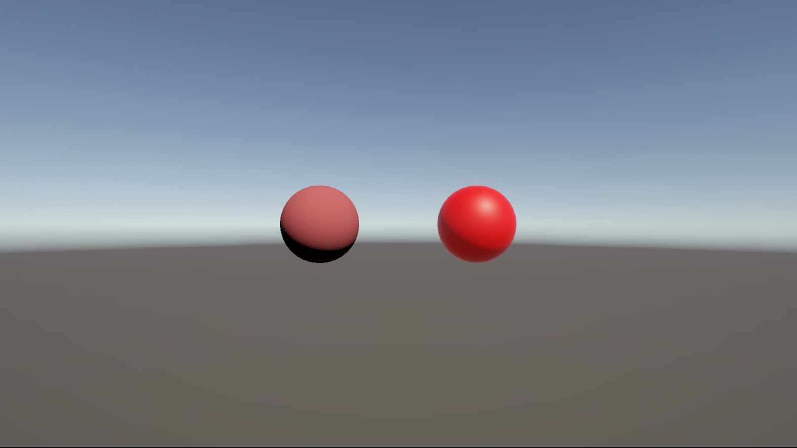
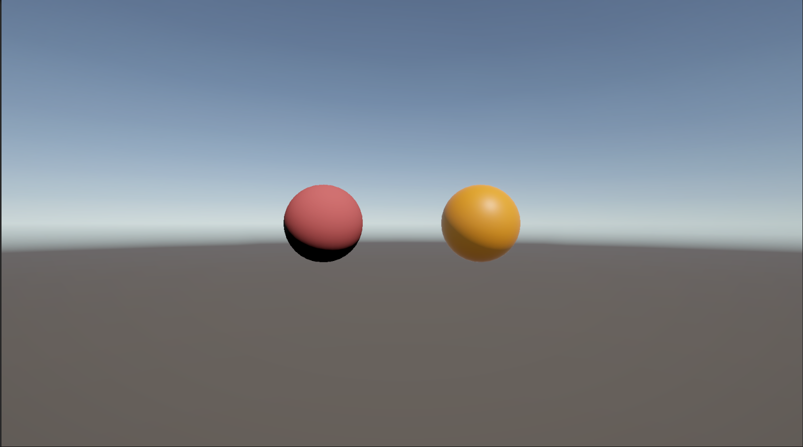
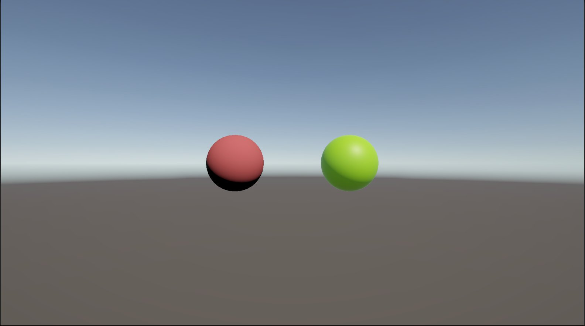

# はじめに
プログラムワークショップⅣの4つ目の管理用です

# 結果画像

Uploading ws4-4_hGGuulzn.mp4…

- 工夫した点：第二回のようにグラデーションを作りました。基本的に使われないと聞いた、グラデーションとシンプルグラデーションを使用して、時間で色が変わるようにしました。
問題点として、値が0と1の色である、赤と緑はきれいに見えるのに対して、その間の色はどうもぎこちなくカクカクして色が移っていると感じました。

# 進め方

- 本リポジトリ(tpu-game-2025/PGWS4_4)をforkしてください。
- fork先のリポジトリを更新してください
- Unityのプロジェクトをsrc内で進めて下さい。
- 結果を画面キャプチャして、画像としてリポジトリに追加して、上記のリンクから見れるようにしてください。
- 完成したら本リポジトリのmainブランチにpull requestを投げてください

